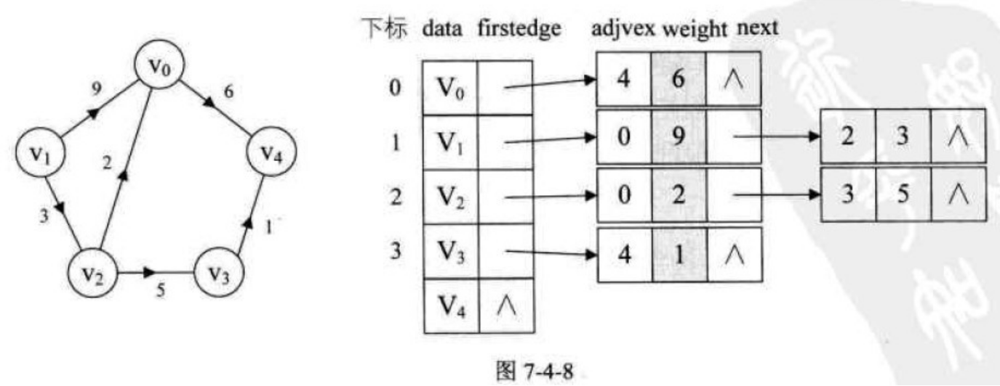

# 图
## 还没想好写什么
## 图的存储结构
操作一个图的基本函数
`getValue(int pos)`:获得指定顶点的值
`getWeight(int v1, int v2)`:获得(v1,v2)的权值
`getFirstNeighbor(int v1)`:找到给定顶点的第一个邻接顶点的位置
`addVertice(V vertice)`:添加结点
`addEdge(int v1, int v2, double w)`:添加边(v1,v2),权值为w
`removeVertice(int vPos)`:删除指定顶点v
`removeEdge(int v1, int v2)`:删除边(v1,v2)
### 邻接矩阵
需要用邻接矩阵adjMatrix[i][j]存储v[i]和v[j]间的权值，用verticeList数组存储顶点值

带权值的图邻接矩阵定义如下
$$adjMatrix[i][j]=\begin{cases}
v[i]和v[j]之间边的权值 & i!=j且两顶点间有边\\
INF & 两顶点间没边\\
0 & i==j
\end{cases}$$

代码
实现的是带权图，构造时可选有向图或无向图
类模板用的是两个参数，但似乎权值给定`double`类型就行了，反正在写的时候都是默认`double`，两个类模板似乎多余了
```c++
#include<iostream>
#include"Queue.h"
using namespace std;
/*0x7fffffff恰好是int型的上界，所以一般情况下用它表示无穷大是一个很好的选择
但是在求图的最短路径时，往往需要进行无穷大数的比较，
而0x7fffffff再加上一个正数会溢出，成为负数，
所以一般情况下，定义为0x3fffffff或者0x3f3f3f3f 就能满足要求*/
#define INF 0x3f3f3f3f//定义无穷大
template<class V, class E>//分别代表顶点和边的数据类型
class GraphAM {
public:
	GraphAM() :isDirected(false),maxNumVertices(20), curNumVertices(0), curNumEdges(0) {
		verticesList = new V[maxNumVertices];
		adjMatrix = new E * [maxNumVertices];
		for (int i = 0; i < maxNumVertices; i++) adjMatrix[i] = new E[maxNumVertices];
		for (int i = 0; i < maxNumVertices; i++)
			for (int j = 0; j < maxNumVertices; j++) {
				adjMatrix[i][j] = (i == j) ? 0 : INF;
			}
	}
	GraphAM(bool isDir,int max) :isDirected(isDir),maxNumVertices(max), curNumVertices(0), curNumEdges(0) {
		verticesList = new V[maxNumVertices];
		adjMatrix = new E * [maxNumVertices];
		for (int i = 0; i < maxNumVertices; i++) adjMatrix[i] = new E[maxNumVertices];
		for (int i = 0; i < maxNumVertices; i++)
			for (int j = 0; j < maxNumVertices; j++) {
				adjMatrix[i][j] = (i == j) ? 0 : INF;
			}
	}
	~GraphAM() {
		delete[]verticesList;
		for (int i = 0; i < maxNumVertices; i++) delete[]adjMatrix[i];
		delete[]adjMatrix;
	};
public:
	void extend() {//顶点满了，扩充

	}
	int getCurNumVertices() { return curNumVertices; }
	int getCurNumEdges() { return curNumEdges; }
	int getVerPos(V vertice) {//获得指定顶点的位置
		for (int i = 0; i < curNumVertices; i++) {
			if (verticesList[i] == vertice)return i;
		}
		return -1;
	}
	V getValue(int pos) {//获得指定顶点的值
		if (pos >= 0 && pos < curNumVertices)
			return verticesList[pos];
		else return NULL;
	}
	E getWeight(int v1, int v2) {//获得(v1,v2)的权值
		if (v1 < 0 || v1 >= curNumVertices || v2 < 0 || v2 >= curNumVertices)return NULL;
		else return adjMatrix[v1][v2];
	}
	int getFirstNeighbor(int v1) {//找到给定顶点的第一个邻接顶点的位置
		if (v1 < 0 || v1 >= curNumVertices)return -1;
		for (int j = 0; j < curNumVertices; j++) {
			if (adjMatrix[v1][j] > 0 && adjMatrix[v1][j] < INF)return j;
		}
		return -1;
	}
	int getNextNeighbor(int vStart, int v) {//返回vStart顶点的邻接顶点v之后的下一个邻接顶点的位置
		if (vStart < 0 || vStart >= curNumVertices || v < 0 || v >= curNumVertices)return -1;
		for (int col = v + 1; col < curNumVertices; col++) {
			if (adjMatrix[vStart][col] > 0 && adjMatrix[vStart][col] < INF)return col;
		}
		return -1;
	}
	bool addVertice(V vertice) {//添加结点
		//结点数量达到上限就扩容
		if (curNumVertices == maxNumVertices)extend();
		verticesList[curNumVertices++] = vertice;
		return true;
	}
	bool addEdge(int v1, int v2, E w) {//添加边(v1,v2),权值为w
		if (v1 < 0 || v1 >= curNumVertices || v2 < 0 || v2 >= curNumVertices)return false;
		else {
			//如果v1和v2本来就有边，添加失败
			if (adjMatrix[v1][v2] > 0 && adjMatrix[v1][v2] < INF)return false;
			//添加成功
			else {
				if(isDirected ==false)adjMatrix[v1][v2] = adjMatrix[v2][v1] = w;//有向图
				else adjMatrix[v1][v2]=w;//无向图
				curNumEdges++;
			}
			return true;
		}
	}
	bool removeVertice(int vPos) {//删除指定顶点v
		//只有一个顶点，或顶点位置不存在，都删除失败
		if (curNumVertices == 1 || vPos<0 || vPos>curNumVertices)return false;
		//集体移动的话邻接矩阵更新工作量就大，可以用最后一个顶点代替被删顶点
		verticesList[vPos] = verticesList[curNumVertices - 1];
		curNumVertices--;
		for (int i = 0; i < curNumVertices + 1; i++) {
			//如果被删顶点v和顶点i有边，则删除边(记录边数-1)
			if (adjMatrix[vPos][i] > 0 && adjMatrix[vPos][i] < INF)curNumEdges--;
			//将被删顶点的边信息更换成代替过来的顶点（最后一个顶点）的边信息
			if (isDirected == false) {//无向图
				if (i != vPos)adjMatrix[vPos][i] = adjMatrix[i][vPos] = adjMatrix[curNumVertices][i];
				if (i == vPos)adjMatrix[vPos][i] = adjMatrix[i][vPos] = adjMatrix[curNumVertices][curNumVertices];
			}
			else {//有向图
				if (i != vPos) {
					adjMatrix[vPos][i] = adjMatrix[curNumVertices][i];
					adjMatrix[i][vPos] = adjMatrix[i][curNumVertices];
				}
				if (i == vPos)adjMatrix[vPos][i] = adjMatrix[i][vPos] = adjMatrix[curNumVertices][curNumVertices];
			}
		}
		return true;
	}
	bool removeEdge(int v1, int v2) {//删除边(v1,v2)
		//顶点位置错误或本来就没边，删除失败
		if (v1 < 0 || v1 >= curNumVertices || v2 < 0 || v2 >= curNumVertices)return false;
		if (adjMatrix[v1][v2] == 0 || adjMatrix[v1][v2] == INF)return false;
		else {
			if (isDirected == false) {//无向图
				adjMatrix[v1][v2] = adjMatrix[v2][v1] = INF;
			}
			else adjMatrix[v1][v2] = INF;//有向图
			curNumEdges--;
		}
		return true;
	}
	void show1() {
		for (int i = 0; i < curNumVertices; i++)
			for (int j = 0; j < curNumVertices; j++) {
				if (adjMatrix[i][j] == INF)cout << "#" << " ";
				else cout << adjMatrix[i][j] << " ";
				if (j == curNumVertices - 1)cout << endl;
			}
	}
	void show2() {
		for (int i = 0; i < curNumVertices; i++) {
			cout << "顶点" << verticesList[i] << "的邻接顶点：";
			for (int j = 0; j < curNumVertices; j++) {
				if (adjMatrix[i][j] != INF && adjMatrix[i][j] != 0)
					cout << verticesList[j] << "(权值" << adjMatrix[i][j] << ") ";
			}
			cout << endl;
		}
	}
	void DFS(V ver) {//从给定的顶点ver开始搜索
		int* flag = new int[curNumVertices] {0};//记录顶点是否已经遍历过
		int pos = getVerPos(ver);//起点
		if (pos == -1)return;
		DFS(pos, flag);
		//这个图可能是不连通的，还有些顶点没遍历到：以没遍历到的顶点为起点继续遍历
		for (int i = 0; i < curNumVertices; i++) {
			if (flag[i] == 0)DFS(i, flag);
		}
	}
	void BFS(V ver) {
		int start = getVerPos(ver);//找位置，没有该顶点就直接返回
		if (start == -1)return;
		V val;//用来暂存出队顶点
		Queue<V> s;//搜索时用到的队列
		//flag标记是否遍历过，为了自己调用自己时保存先前记录，因此用static变量
		static int* flag = new int[curNumVertices] {0};
		s.EnQueue(ver);//先将起点入队
		flag[start] = 1;//标记起点已遍历过
		while (!s.isEmpty()) {
			s.DeQueue(val);
			start = getVerPos(val);//以出队顶点为起点，向外搜索一层
			cout << val << " ";
			int p = getFirstNeighbor(start);
			//将所有与出队顶点相邻的顶点（未遍历）入队
			while (p != -1) {
				if (flag[p] == 0) {
					s.EnQueue(verticesList[p]);
					flag[p] = 1;//入队时就标记
				}
				p = getNextNeighbor(start, p);
			}
		}
		//这个图可能是不连通的，还有些顶点没遍历到：以没遍历到的顶点为起点继续遍历
		for (int i = 0; i < curNumVertices; i++) {
			if (flag[i] == 0)BFS(getValue(i));
		}
	}
private:
	bool isDirected;//false为无向图，true为有向图
	V* verticesList;//顶点表
	E** adjMatrix;//邻接矩阵
	int maxNumVertices;//最大顶点数
	int curNumVertices;//当前顶点数
	int curNumEdges;//当前边数
	void DFS(int pos,int*flag) {
		flag[pos] = 1;//记录这个顶点遍历到了
		cout <<getValue(pos)<<" ";//输出
		//如果这个顶点有邻接顶点，就继续DFS；否则就返回
		int p = getFirstNeighbor(pos);
		if (p == -1)return;
		else {
			//对当下顶点的每个邻接顶点进行DFS
			while (p != -1) {
				if (flag[p] == 0)DFS(p, flag);
				p = getNextNeighbor(pos, p);
			}
		}
	}
};
```
### 邻接表

该存储结构有两个表，一个是存放顶点的顶点表（数组），一个是存放边结点的边表（单链表）。

顶点结构体属性包括：顶点的值，指向边表的指针。
边结点结构体属性包括：边的另一个顶点的位置，边的权值，和一个next指针

代码
实现的是带权图，构造时可选择有向图或无向图
这里权值我直接默认是`double`类型，所以类模板就一个参数了
邻接表在删边，删结点的时候比较繁琐
**删边，删结点在有向图时有bug，有时间再来改**
```c++
#include<iostream>
#include"Queue.h"
using namespace std;
#define INF 0x3f3f3f3f//定义无穷大
//构成边表的结点
struct EdgeNode {
	int anotherVer;//另一个顶点在顶点表里的位置
	double weight;//边的权值
	EdgeNode* next;
	EdgeNode() {};
	EdgeNode(int v, double w) :anotherVer(v), weight(w), next(nullptr) {};
};
template<class V>
struct Vertice {
	V value;//顶点的值
	EdgeNode* adj;//邻接边表
	Vertice() :adj(nullptr) {};
};
template <class V>
class GraphAL {
public:
	GraphAL() :isDirected(false),maxNumVertices(20), curNumVertices(0), curNumEdges(0) {
		verNodeTable = new Vertice<V>[maxNumVertices];
	}
	GraphAL(bool isDir,int max) :isDirected(isDir),maxNumVertices(max), curNumVertices(0), curNumEdges(0) {
		verNodeTable = new Vertice<V>[maxNumVertices];
	}
	~GraphAL() {};
public:
	void extend() {//顶点满了，扩充

	}
	V getValue(int pos) {//获得指定顶点的值
		if (pos < 0 || pos >= curNumVertices)return NULL;
		return verNodeTable[pos].value;
	}
	double getWeight(int v1, int v2) {//获得(v1,v2)的权值
		if (v1 < 0 || v1 >= curNumVertices || v2 < 0 || v2 >= curNumVertices)return NULL;
		EdgeNode* temp = verNodeTable[v1].adj;
		if (temp == nullptr)return INF;
		else {
			while (temp != nullptr) {
				if (temp->anotherVer == v2)return temp->weight;
				else temp = temp->next;
			}
		}
		return INF;
	}
	int getVerticePos(V ver) {
		for (int i = 0; i < curNumVertices; i++) {
			if (verNodeTable[i].value == ver)return i;
		}
		return -1;
	}
	int getCurNumVertices() { return curNumVertices; }
	int getCurNumEdges() { return curNumEdges; }
	int getFirstNeighbor(int v1) {//找到给定顶点的第一个邻接顶点的位置
		if (v1 < 0 || v1 >= curNumVertices)return -1;
		EdgeNode* temp = verNodeTable[v1].adj;
		if (temp == nullptr)return -1;
		else return temp->anotherVer;
	}
	int getNextNeighbor(int v1, int v2) {//在以v1为起点的边表中，返回边（v1,v2）的下一条边的邻接顶点
		if (v1 < 0 || v1 >= curNumVertices)return -1;
		EdgeNode* temp = verNodeTable[v1].adj;
		if (temp == nullptr)return -1;
		while (temp != nullptr && temp->anotherVer != v2)temp = temp->next;
		if (temp != nullptr && temp->next != nullptr)return temp->next->anotherVer;
		return -1;
	}
	bool addVertice(V vertice) {//添加结点
		//结点数达到上限，扩容
		if (curNumVertices == maxNumVertices)extend();
		verNodeTable[curNumVertices++].value = vertice;
		return true;
	}
	bool addEdge(int v1, int v2, double w) {//添加边(v1,v2),权值为w
		if (v1 < 0 || v1 >= curNumVertices || v2 < 0 || v2 >= curNumVertices)return false;
		//创建两个边结点：v1到v2和v2到v1
		EdgeNode* temp = nullptr;
		//将边结点联入v1顶点的边链表
		temp = verNodeTable[v1].adj;
		if (temp == nullptr)verNodeTable[v1].adj = new EdgeNode(v2, w);
		else {
			while (temp->next != nullptr) {
				//这条边已经在边链表中，添加失败
				if (temp->anotherVer == v2)return false;
				temp = temp->next;
			}
			temp->next = new EdgeNode(v2, w);
		}
		//无向图的额外操作：将边结点联入v2顶点的边链表
		if (isDirected == false) {
			temp = verNodeTable[v2].adj;
			if (temp == nullptr)verNodeTable[v2].adj = new EdgeNode(v1, w);
			else {
				while (temp->next != nullptr) {
					//这条边已经在边链表中，添加失败
					if (temp->anotherVer == v1)return false;
					temp = temp->next;
				}
				temp->next = new EdgeNode(v1, w);
			}
		}
		//记得边数+1
		curNumEdges++;
		return true;
	}
	bool removeVertice(int vPos) {//删除指定顶点v
		if (vPos < 0 || vPos >= curNumVertices)return false;
		if (curNumVertices == 1)return false;//只有一个顶点，删除失败
		EdgeNode* temp = verNodeTable[vPos].adj;//遍历边表的指针
		EdgeNode* preTem = nullptr;//遍历边表的指针的前驱指针
		//把被删顶点的边表删除，并且将每个边关联到的另一个顶点的对应边结点删除
		while (temp != nullptr) {
			//无向图的额外操作：把边关联到的另一个顶点那里的对应边结点删除
			if (isDirected == false) {
				int v = temp->anotherVer;
				EdgeNode* p = verNodeTable[v].adj;
				EdgeNode* pre = nullptr;
				while (p != nullptr && p->anotherVer != vPos) {
					pre = p;
					p = p->next;
				}
				if (pre == nullptr)verNodeTable[v].adj = p->next;//删头节点情况
				else pre->next = p->next;//应该要判断p不为空的，但一定找的到，所以就不判断了
				delete p;
			}
			//关联的信息删完后，将待删边表的对应结点删除
			preTem = temp;
			temp = temp->next;
			delete preTem;
			curNumEdges--;//记得边数-1
		}
		//边表删完后，用最后一个顶点代替被删顶点的位置,同时更新边表
		curNumVertices--;//记得顶点数-1
		verNodeTable[vPos].value = verNodeTable[curNumVertices].value;
		verNodeTable[vPos].adj = verNodeTable[curNumVertices].adj;
		//无向图额外的操作：
		/*找到与最后一个顶点的边关联的另一个顶点，去它那的边表里找到
				对应边结点，将关联地址改为vPos*/
		if (isDirected == false) {
			EdgeNode* update = verNodeTable[vPos].adj;
			while (update != nullptr) {
				int n = update->anotherVer;
				EdgeNode* q = verNodeTable[n].adj;
				while (q != nullptr) {
					if (q->anotherVer == curNumVertices) {
						q->anotherVer = vPos;
						break;
					}
					q = q->next;
				}
				update = update->next;
			}
		}
		return true;
	}
	bool removeEdge(int v1, int v2) {//删除边(v1,v2)
		if (v1 < 0 || v1 >= curNumVertices || v2 < 0 || v2 >= curNumVertices)return false;
		EdgeNode* temp1 = verNodeTable[v1].adj;
		EdgeNode* temp2 = verNodeTable[v2].adj;
		EdgeNode* pre1 = nullptr;//给链表删除结点时要记录被删结点的前驱结点
		EdgeNode* pre2 = nullptr;//给链表删除结点时要记录被删结点的前驱结点
		//边表为空，删除失败
		if (temp1 == nullptr || temp2 == nullptr)return false;
		//去v1的边链表里删除边
		while (temp1 != nullptr && temp1->anotherVer != v2) {
			pre1 = temp1;
			temp1 = temp1->next;
		}
		if (temp1 != nullptr) {//非空，则找到要删的边
			if (pre1 == nullptr)verNodeTable[v1].adj = temp1->next;//删头节点的情况
			else pre1->next = temp1->next;
			delete temp1;
		}
		else return false;//没找到要删的边，删除失败
		//无向图额外的操作：去v2的边链表里删除边
		if (isDirected == false) {
			while (temp2 != nullptr && temp2->anotherVer != v1) {
				pre2 = temp2;
				temp2 = temp2->next;
			}
			if (temp2 != nullptr) {//非空，则找到要删的边
				if (pre2 == nullptr)verNodeTable[v2].adj = temp2->next;//删头节点的情况
				else pre2->next = temp2->next;
				delete temp2;
			}
			else return false;//没找到要删的边，删除失败
		}
		//记得边数-1
		curNumEdges--;
		return true;
	}
	void show() {
		for (int i = 0; i < curNumVertices; i++) {
			cout << "顶点" << verNodeTable[i].value;
			cout << "的关联顶点：";
			EdgeNode* temp = verNodeTable[i].adj;
			while (temp != nullptr) {
				int n = temp->anotherVer;
				cout << verNodeTable[n].value << "(权值" << temp->weight << ") ";
				temp = temp->next;
			}
			cout << endl;
		}
	}
	void DFS(V ver) {
		int vPos = getVerticePos(ver);//起点
		if (vPos == -1)return;
		int* flag = new int[curNumVertices] {0};//记录顶点是否已经遍历过
		DFS(vPos, flag);
		//这个图可能是不连通的，还有些顶点没遍历到：以没遍历到的顶点为起点继续遍历
		for (int i = 0; i < curNumVertices; i++) {
			if (flag[i] == 0)DFS(i, flag);
		}
	}
	void BFS(V ver) {
		int start = getVerticePos(ver);//获得其实顶点的位置
		if (start == -1)return;
		//flag标记是否遍历过，为了自己调用自己时保存先前记录，因此用static变量
		static int* flag = new int[curNumVertices] {0};
		Queue<Vertice<V>>s;//队列存储的是顶点的数据类型
		Vertice<V> temp;//暂存出队顶点
		s.EnQueue(verNodeTable[start]);//将起始顶点入队
		flag[start] = 1;
		while (!s.isEmpty()) {
			s.DeQueue(temp);
			start = getVerticePos(temp.value);//以出队顶点为起点，向外搜索一层
			cout << temp.value << " ";
			EdgeNode* p = temp.adj;
			while (p != nullptr) {//将所有与出队顶点相邻的顶点（未遍历）入队
				if (flag[p->anotherVer] == 0) {
					s.EnQueue(verNodeTable[p->anotherVer]);
					flag[p->anotherVer] = 1;//入队就标记
				}
				p = p->next;
			}
		}
		//这个图可能是不连通的，还有些顶点没遍历到：以没遍历到的顶点为起点继续遍历
		for (int i = 0; i < curNumVertices; i++) {
			if (flag[i] == 0)BFS(getValue(i));
		}
	}
private:
	bool isDirected;//false为无向图，true为有向图
	Vertice<V>* verNodeTable;//存放顶点的表
	int maxNumVertices;//最大顶点数
	int curNumVertices;//当前顶点数
	int curNumEdges;//当前边数
	void DFS(int vPos, int* flag) {
		flag[vPos] = 1;//记录遍历过了
		cout << verNodeTable[vPos].value << " ";//输出
		EdgeNode* temp = verNodeTable[vPos].adj;//获得该顶点的边表
		//如果边表为空（无邻接顶点），直接返回；否则对每个邻接顶点进行DFS
		if (temp == nullptr)return;
		while (temp != nullptr) {
			if (flag[temp->anotherVer] == 0)DFS(temp->anotherVer, flag);
			else temp = temp->next;//回溯后，继续走本顶点的边表，看看还有没有邻接顶点
		}
	}
};

```
### 十字链表
### 邻接多重表
### 性能比较
## 图的遍历
**网上大多数代码都默认图是连通的，也就是从任意顶点开始都能遍历完图中所有顶点。但以下我写的代码，图可能是不连通的，因此在算法最后会检查是否有没遍历到的顶点，如果有，就已没遍历的顶点为起点继续遍历**
### DFS
深度优先搜索：一条路走到黑，没路了再返回，返回后每个回溯点都看看有没有其他还没走的路，如果有，重复上述操作

关键在回溯$\Rightarrow$递归好写

代码
承接上面存储结构的代码
* DFS邻接矩阵
```c++
public:
void DFS(V ver) {//从给定的顶点ver开始搜索
		int* flag = new int[curNumVertices] {0};//记录顶点是否已经遍历过
		int pos = getVerPos(ver);//起点
		if (pos == -1)return;
		DFS(pos, flag);
		//这个图可能是不连通的，还有些顶点没遍历到：以没遍历到的顶点为起点继续遍历
		for (int i = 0; i < curNumVertices; i++) {
			if (flag[i] == 0)DFS(i, flag);
		}
	}
private:
void DFS(int pos,int*flag) {
		flag[pos] = 1;//记录这个顶点遍历到了
		cout <<getValue(pos)<<" ";//输出
		//如果这个顶点有邻接顶点，就继续DFS；否则就返回
		int p = getFirstNeighbor(pos);
		if (p == -1)return;
		else {
			//对当下顶点的每个邻接顶点进行DFS
			while (p != -1) {
				if (flag[p] == 0)DFS(p, flag);
				p = getNextNeighbor(pos, p);
			}
		}
	}
```
* DFS邻接表
```c++
public:
void DFS(V ver) {
		int vPos = getVerticePos(ver);//起点
		if (vPos == -1)return;
		int* flag = new int[curNumVertices] {0};//记录顶点是否已经遍历过
		DFS(vPos, flag);
		//这个图可能是不连通的，还有些顶点没遍历到：以没遍历到的顶点为起点继续遍历
		for (int i = 0; i < curNumVertices; i++) {
			if (flag[i] == 0)DFS(i, flag);
		}
	}
private:
void DFS(int vPos, int* flag) {
		flag[vPos] = 1;//记录遍历过了
		cout << verNodeTable[vPos].value << " ";//输出
		EdgeNode* temp = verNodeTable[vPos].adj;//获得该顶点的边表
		//如果边表为空（无邻接顶点），直接返回；否则对每个邻接顶点进行DFS
		if (temp == nullptr)return;
		while (temp != nullptr) {
			if (flag[temp->anotherVer] == 0)DFS(temp->anotherVer, flag);
			else temp = temp->next;//回溯后，继续走本顶点的边表，看看还有没有邻接顶点
		}
	}
```
### BFS
广度优先搜索：每次，每个顶点都只向外扩散一层

关键在队列实现

代码
承接上面存储结构的代码
* BFS邻接矩阵
```c++
public:
void BFS(V ver) {
		int start = getVerPos(ver);//找位置，没有该顶点就直接返回
		if (start == -1)return;
		V val;//用来暂存出队顶点
		Queue<V> s;//搜索时用到的队列
		//flag标记是否遍历过，为了自己调用自己时保存先前记录，因此用static变量
		static int* flag = new int[curNumVertices] {0};
		s.EnQueue(ver);//先将起点入队
		flag[start] = 1;//标记起点已遍历过
		while (!s.isEmpty()) {
			s.DeQueue(val);
			start = getVerPos(val);//以出队顶点为起点，向外搜索一层
			cout << val << " ";
			int p = getFirstNeighbor(start);
			//将所有与出队顶点相邻的顶点（未遍历）入队
			while (p != -1) {
				if (flag[p] == 0) {
					s.EnQueue(verticesList[p]);
					flag[p] = 1;//入队时就标记
				}
				p = getNextNeighbor(start, p);
			}
		}
		//这个图可能是不连通的，还有些顶点没遍历到：以没遍历到的顶点为起点继续遍历
		for (int i = 0; i < curNumVertices; i++) {
			if (flag[i] == 0)BFS(getValue(i));
		}
	}
```
* BFS邻接表
```c++
public:
	void BFS(V ver) {
		int start = getVerticePos(ver);//获得其实顶点的位置
		if (start == -1)return;
		//flag标记是否遍历过，为了自己调用自己时保存先前记录，因此用static变量
		static int* flag = new int[curNumVertices] {0};
		Queue<Vertice<V>>s;//队列存储的是顶点的数据类型
		Vertice<V> temp;//暂存出队顶点
		s.EnQueue(verNodeTable[start]);//将起始顶点入队
		flag[start] = 1;
		while (!s.isEmpty()) {
			s.DeQueue(temp);
			start = getVerticePos(temp.value);//以出队顶点为起点，向外搜索一层
			cout << temp.value << " ";
			EdgeNode* p = temp.adj;
			while (p != nullptr) {//将所有与出队顶点相邻的顶点（未遍历）入队
				if (flag[p->anotherVer] == 0) {
					s.EnQueue(verNodeTable[p->anotherVer]);
					flag[p->anotherVer] = 1;//入队就标记
				}
				p = p->next;
			}
		}
		//这个图可能是不连通的，还有些顶点没遍历到：以没遍历到的顶点为起点继续遍历
		for (int i = 0; i < curNumVertices; i++) {
			if (flag[i] == 0)BFS(getValue(i));
		}
	}
```
### 连通分量
## 最小生成树
### 前置
**生成树**
如果**连通图**的一个子图是一棵包含所有顶点的树，则该子图称为G的生成树(SpanningTree)。换句话说，生成树是由图中所有顶点构成的极小连通子图。
> Informally, a minimum spanning tree of an undirected graph G is a tree formed from graph edges that connects all the vertices of G at lowest total cost. A minimum spanning tree exists if and only if G is connected. 

满足性质：边数=顶点数-1

生成树并不唯一，只要能连通所有顶点而又不产生回路的任何子图都是G的生成树（DFS生成树，BFS生成树，Kruskal最小生成树树，Prim最小生成树...）
**最小生成树**
对于无向连通图来说，权值最小的生成树被成为最小生成树。
**不同算法的作用对象**
Kruskal和Prim算法适用求*无向连通图*的最小生成树
Chu-Liu/Edmonds算法适用于求*有向连通图*的最小生成树

**先将最小生成树的边界点定义出来**
```c++
struct MSTEdgeNode {
	int v1;
	int v2;//两个端点的位置
	double weight;//边的权值
	bool operator >(MSTEdgeNode& s) {
		if (this->weight > s.weight)return true;
		else return false;
	}
	bool operator <(MSTEdgeNode& s) {
		if (this->weight < s.weight)return true;
		else return false;
	}
	bool operator >=(MSTEdgeNode& s) {
		if (this->weight >= s.weight)return true;
		else return false;
	}
	bool operator <=(MSTEdgeNode& s) {
		if (this->weight <= s.weight)return true;
		else return false;
	}
};
```
为了方便，默认传进来的图都是连通图
### Kruskal算法（避圈法）
**贪心策略**
考察每一条边，每次拿出权值最小的边，若两端点在同一连通分量（加上这个边，就会构成一个回路），则舍弃；不在同一连通分量，则加入生成树

**分析用什么结构**
显然，用一个最小堆可以解决每次都拿权值最小边的问题
考察两端点是否在同一连通分量里，实际上就是一个等价类问题，可以用到并查集
>Formally, Kruskal’s algorithm maintains a forest—a collection of trees. Initially, there are |V| single-node trees. Adding an edge merges two trees into one. When the algorithm terminates, there is only one tree, and this is the minimum spanning tree. 

**代码实现**
最小堆，并查集的代码都是用我以前自己实现的代码
*注意：我的`GraphAM`没有重写拷贝构造函数，如果只是传参类对象，副本的指针变量是直接赋值，函数退出后指针会被delete一次，main函数结束后原本的对象也要析构，那指针就会被delete两次，触发断点。所以这里为了简单（懒得重写复制构造函数），直接传引用*

邻接矩阵和邻接表的代码一模一样（这两个结构一样功能的函数，名字我都起的一样），只是在它们各自结构里相同功能的函数的实现不一样而已
```c++
template <class V, class E>
//参数换成(GraphAL<V> &graph)就是邻接表的代码
vector<MSTEdgeNode> Kruskal(GraphAM<V, E> &graph) {
	int edgeNum = graph.getCurNumEdges();//获取图的边数
	int verNum = graph.getCurNumVertices();//获取边的顶点数
	vector<MSTEdgeNode> mst;//数组存储最小生成树的边
	MinHeap<MSTEdgeNode>* hp = new MinHeap<MSTEdgeNode>[edgeNum];//最小堆存储边结点
	DisjSets ds(verNum);//并查集存放顶点：第i个顶点的在树中的父顶点是ds[i]
	MSTEdgeNode minEdge;//暂存每次取出来的最小边
	//先将图中所有边结点入最小堆
	for (int i = 0; i < verNum; i++) {
		int v = graph.getFirstNeighbor(i);
		while (v != -1) {
			double w = graph.getWeight(i, v);
			MSTEdgeNode temp{ i,v,w };
			hp->EnMinHeap(temp);
			v = graph.getNextNeighbor(i, v);
		}
	}
	//构建最小生成树，中止条件：边数=顶点数-1
	while (mst.size() <verNum-1) {
		//MSTEdgeNode minEdge;
		hp->DeMinHeap(minEdge);
		int set1 = ds.find(minEdge.v1);//获取v1所在的连通分量
		int set2 = ds.find(minEdge.v2);//获取v2所在的连通分量
		if (set1 != set2) {//如果不在一个连通分量，就加入最小生成树
			mst.push_back(minEdge);
			ds.unionSets(set1, set2);//将这v1，v2所在的连通分量合并
		}
	}
	return mst;//返回构建好的最小生成树
}
```

### Prim算法
**贪心策略**
每次选出一个端点在生成树中，另一个端点不在生成树中的权值最小的边加入生成树

**代码实现**
呃呃网上的代码看得有点晕，我这个好像写的和那些代码长得不太一样（但我觉得思路是一样的），但结果是对的

邻接矩阵和邻接表的代码一模一样（这两个结构一样功能的函数，名字我都起的一样），只是在它们各自结构里相同功能的函数的实现不一样而已
```c++
template<class V,class E>
//参数换成GraphAL<V>& graph就是邻接表的代码
vector<MSTEdgeNode> Prim(GraphAM<V, E>& graph,V ver) {
	int curAdd = graph.getVerPos(ver);//记录刚加入生成树的顶点的位置
	int edgeNum = graph.getCurNumEdges();//获取图的边数
	int verNum = graph.getCurNumVertices();//获取边的顶点数
	int* isInMST = new int[verNum]{0};//记录对应顶点是否在生成树里
	MinHeap<MSTEdgeNode>* hp = new MinHeap<MSTEdgeNode>[edgeNum];//最小堆存储边结点
	vector<MSTEdgeNode> mst;//数组存储最小生成树的边
	MSTEdgeNode minEdge;//暂存每次取出来的最小边
	isInMST[curAdd] = 1;//先将起始点记录为在生成树中
	//开始操作
	while (mst.size() < verNum - 1) {//中止条件：边数=顶点数-1
		//将与【新加入生成树的顶点】相连的所有边加入最小堆
		int j = graph.getFirstNeighbor(curAdd);
		while(j!=-1) {
			MSTEdgeNode edge{ curAdd,j,graph.getWeight(curAdd,j) };
			hp->EnMinHeap(edge);
			j = graph.getNextNeighbor(curAdd, j);
		}
		//获取一个顶点在生成树，另一个顶点不在生成树的最小边
		hp->DeMinHeap(minEdge);
		while (isInMST[minEdge.v2] == 1) hp->DeMinHeap(minEdge);
		//将这个最小边加入生成树
		mst.push_back(minEdge);
		curAdd = minEdge.v2;//新加入的结点就是最小边的v2
		isInMST[curAdd] = 1;//标记在生成树里
	}	
	return mst;//返回构建好的最小生成树
}
```
### Kruskal和Prim算法对比分析
**直观上的感觉**
Kruskal每次都选一个不构成回路的最小边出来，因此这些边是零散分布的，在最终形成一个最小生成树之前，是一个个最小生成树森林

Prim每次都是选出和生成树相连的边里最小的那个，因此自始至终都是连通的

**性能分析（性能推导看书）**
一般情况下Kruskal算法更快，Prim算法适合稠密矩阵（边数远大于顶点数）
>Use Prim's algorithm when you have a graph with lots of edges.For a graph with V vertices E edges, Kruskal's algorithm runs in O(E log V) time and Prim's algorithm can run in O(E + V log V) amortized time, if you use a Fibonacci Heap.
Prim's algorithm is significantly faster in the limit when you've got a really dense graph with many more edges than vertices. Kruskal performs better in typical situations (sparse graphs) because it uses simpler data structures.
### Chu-Liu/Edmonds算法
## 最短路径
### 最短路径问题的共性思路
**带权有向图和带权无向图都适用，有向图的实际应用意义更大**

**最短路径的子路径也是最短路径**
规定p=<v~0~,v~1~,...v~k~>是v~0~到v~k~的最短路径，对于任意0<=i<=j<=k,s=<v~i~,v~i+1~,...v~j~>是p的一条子路径，则s是v~i~到v~j~的最短路径
这说明最短路径问题有*最优子结构*
>Recall that optimal substructure is one of the key indicators that dynamic programming and the greedy method might apply. Dijkstra’s algorithm is a greedy algorithm, and the FloydWarshall algorithm, which finds shortest paths between all pairs of vertices is a dynamic-programming algorithm.

**如果图有负权值圈，最短路径无解**
当一个图含负权值边时，就可能出现负权值圈，这个时候最短路径就很难去定义（一直绕着那个负全圈走，路径长度到最后就变成了负无穷），最短路径问题无解

**最短路径必然不含圈**
图的任意一条最短路径既不能包含负权回路，也不会包含正权回路，因此它**最多包含|v|-1条边**（这在Bellman-Ford算法里十分关键）
不含负值圈，正值圈解释
>Can a shortest path contain a cycle? As we have just seen, it cannot contain a negative-weight cycle. Nor can it contain a positive-weight cycle, since removing the cycle from the path produces a path with the same source and destination vertices and a lower path weight.

不含0权值圈解释
>We can remove a 0-weight cycle from any path to produce another path whose weight is the same. Thus, if there is a shortest path from a source vertex s to a destination vertex that contains a 0-weight cycle, then there is another shortest path from s to without this cycle.

**保存路径**
对于每个顶点，都只需记录最短路径中本顶点的前驱顶点

**松弛技术Relaxation**
松弛边(u,v)的过程:源点s到v的距离如果能在经过u的情况下缩短，则更新路径长度和路径前驱
换句话说。就是用现在的最短路径更新其他的路径
>Relaxation is the only means by which shortestpath estimates and predecessors change. 

不同算法的主要区别就在于松弛的次数和时机
>The algorithms in this chapter differ in how many times they relax each edge and the order in which they relax edges Dijkstra’s algorithm and the shortest-paths algorithm for directed acyclic graphs relax each edge exactly once. The Bellman-Ford algorithm relaxes each edge |V|-1 times.

### 单源最短路径
**不带权值的单源最短路径**

**任意权值的单源最短路径——Bellman-Ford算法**
* 运用最短路必然无环的性质
假设有n个顶点，那么最短路的边最多n-1条，此时如果再加一条边，松弛操作仍成立，就说明有负权值圈，最短路问题无解。
* 动态规划
在经过不超过k条边的条件下，计算源点到i的最短路
Bellman-Ford(k,i)=min{Bellman-Ford(k-1,i),Bellman-Ford(k-1,j)+weight(j,i)}
同理
$$path(k,i)=\begin{cases}
	path(k-1,i) & dist[i]<dist[j]+weight(j,i)\\
	path(k-1,j) & dist[i]>dist[j]+weight(j,i)\\
\end{cases}$$
* 代码
k对应动态规划的阶段，因此在最外层循环
```c++
bool BellmanFord(GraphAM<V, E>& graph, V ver, double dist[], int path[]) {
	int vPos = graph.getVerPos(ver);//获得源点位置
	int verNum = graph.getCurNumVertices();//获得总结点数
	//初始化操作
	for (int k = 0; k < verNum; k++) {
		dist[k] = (k == vPos) ? 0 : INF;
		path[k] = (k == vPos) ? 0 : -1;
	}
	for (int k = 1; k < verNum; k++) {//v经过不多于k条边到达终点的最短距离
		//对每条边松弛
		for (int i = 0; i < verNum; i++) {
			if (i != vPos) {
				for (int j = 0; j < verNum; j++) {
					double w = graph.getWeight(j, i);
					if (dist[i] > dist[j] + w) {
						dist[i] = dist[j] + w;
						path[i] = j;
					}
				}
			}
		}
	}
	//再对所有边判断，如果还能松弛，说明有负权值圈，无解
	for (int i = 0; i < verNum; i++) {
		if (i != vPos) {
			for (int j = 0; j < verNum; j++) {
				double w = graph.getWeight(j, i);
				if (dist[i] > dist[j] + w) return false;
			}
		}
	}
	return true;
}
```
* 对判断是否有负权值圈进行优化
```c++

```
**优先级队列优化Bellman-Ford算法——SPFA算法**

**非负权值的单源最短路径——Dijkstra算法**
* 辅助数组的含义
dist[i]：源点s到顶点i的最短距离
path[i]：源点s到顶点i的最短路径中，i的前驱顶点
集合S：存放最短路径已经确定的顶点
集合Q：顶点全集V-S，存放最短路径未确定的顶点
book[i]：标记顶点i的最短路径是否已经确定（true，顶点在集合S中；false，顶点在集合Q中）

* 贪心策略
每一轮，都把一个到源点s距离最短（dist[i]最小）且在集合Q中的顶点v取出，放入集合S（标记book[i]=true），然后经由v，对集合Q中的顶点进行松弛操作。整个算法的中止条件就是Q为空集，也就是S=全集V，所有顶点的最短路径都被确定。

* Dijkstra算法运用到了BFS算法和Prim算法的思想
>It is like breadth-first search in that set S corresponds to the set of black vertices in a breadth-first search; just as vertices in S have their final shortest-path weights, so do black vertices in a breadth-first search have their correct breadth-first distances.
Dijkstra’s algorithm is like Prim’s algorithm in that both algorithms use a min-priority queue to find the “lightest” vertex outside a given set (the set S in Dijkstra’s
algorithm and the tree being grown in Prim’s algorithm), add this vertex into the set, and adjust the weights of the remaining vertices outside the set accordingly.

* 代码
```c++
template<class V, class E>
void Disjkstra(GraphAM<V, E>& graph, V ver, double dist[], int path[]) {
	int vPos = graph.getVerPos(ver);//获得源点位置
	int verNum = graph.getCurNumVertices();//获得总结点数
	bool* book = new bool[verNum];//标记顶点最短路径是否已经确定
	//初始化操作
	for (int k = 0; k < verNum; k++) {
		dist[k] = graph.getWeight(vPos, k);
		//与源点相邻，初始化路径前驱就是源点，否则置为-1
		if (k!=vPos&&dist[k] < INF)path[k] = vPos;
		else path[k] = -1;
		book[k] = false;//一开是，所有顶点都在集合Q
	}
	int newAdd = vPos;//将源点加入集合S
	book[vPos] = true;//源点的最短路径标记为已知
	dist[vPos] = 0;//源点到自己的距离规定为1
	//正式开始算法操作
	for (int i = 0; i < verNum; i++) {
		//找出与源点距离最短且在集合Q中的顶点
		int min = INF;
		for (int j = 0; j < verNum; j++) {
			if (book[j] == false && dist[j] < min) {
				newAdd = j;
				min = dist[j];
			}
		}
		book[newAdd] = true;//将这一顶点放入集合S
		//经由这个新加入集合S的顶点，对集合Q中的顶点进行松弛操作
		for (int k = 0; k < verNum; k++) {
			double w = graph.getWeight(newAdd, k);
			if (book[k] == false && dist[k] > dist[newAdd] + w) {
				dist[k] = dist[newAdd] + w;
				path[k] = newAdd;
			}
		}
	}
}
```
搞不懂为什么要有book，我这样也能啊？？
```c++
template<class V,class E>
void Disjkstra(GraphAM<V,E>&graph,V ver,double dist[],int path[]) {
	int vPos = graph.getVerPos(ver);
	int verNum = graph.getCurNumVertices();
	for (int k = 0; k < verNum; k++) {
		dist[k] = graph.getWeight(vPos, k);
		if (dist[k] < INF)path[k] = vPos;
		else path[k] = -1;
	}
	for (int i = 0; i < verNum; i++)
		for (int j = 0; j < verNum; j++) {
			if (dist[i] > dist[j] + graph.getWeight(j, i)) {
				dist[i] = dist[j] + graph.getWeight(j, i);
				path[i] = j;
			}
		}
}
```
* 用优先级队列优化
```c++

```

### 多源最短路径——Floyd算法
**动态规划**
用dist[i][j]来存放i到j的最短距离，用path[i][j]来存放i到j最短路径中j的前驱顶点
策略是：
在经过编号不超过k的顶点的条件下，探究i到j的最短路。
Floyd(k,i,j)=min{Floyd(k-1,i,j),Floyd(k-1,i,k)+Floyd(k-1,k,j)}
同理
$$path[i][j]=\begin{cases}
	path[i][j] & dist[i][j]<dist[i][k]+dist[k][j]\\
	path[k][j] & dist[i][j]>dist[i][k]+dist[k][j]\\
\end{cases}$$
**代码**
注意：k对应动态规划的阶段，因此放在最外层循环
```c++
template <class V, class E>
void Floyd(GraphAM<V, E>& graph, double **dist, int **path) {
	int verNum = graph.getCurNumVertices();//获得总结点数
	//初始化操作
	for(int i=0;i<verNum;i++)
		for (int j = 0; j < verNum; j++) {
			dist[i][j] = graph.getWeight(i, j);
			if (dist[i][j] == INF||i==j)path[i][j] = 0;
			else path[i][j] = i;
		}
	for(int k=0;k<verNum;k++)//动态规划的阶段
		for(int i=0;i<verNum;i++)
			for (int j = 0; j < verNum; j++) {
				if (dist[i][j] > dist[i][k] + dist[k][j]) {
					dist[i][j] = dist[i][k] + dist[k][j];
					path[i][j] = path[k][j];
				}
			}
}
```
## Topological Sort拓扑排序
**是啥玩意**
把有向无环图中各顶点间的前驱，后继关系用线性顺序表现出来
>A topological sort is an ordering of vertices in a directed acyclic graph, such that if there is a path from vi to vj, then vj appears after vi in the ordering.
We can view a topological sort of a graph as an ordering of its vertices along a horizontal line so that all directed edges go from left to right.

**必须是在有向无环图里才成立**
在无向图中或v~i~和v~j~构成环，那它们都是既为彼此的前驱也为彼此的后继，这样就排不了序了

**算法描述**
找到一个没有直接前驱（入度=0）的顶点v，输出v，然后删除v顶点和v的所有边，重复上述操作。
算法结束后（没有入度=0的顶点），如果还有顶点剩余，说明有向图有环，不满足要求；否则拓扑排序成功。

**优化代码**
邻接矩阵和邻接表的代码一样，只是传参不一样
```c++
//传GraphAM<V,E>就是邻接矩阵的代码
template <class V>
bool TopologicalSortAL(GraphAL<V>& graph) {
	int verNum = graph.getCurNumVertices();//获得顶点个数
	Queue<V> q;//用队列存放入度=0的顶点
	int* inDegree = new int[verNum]{0};//记录各顶点的入度
	int amount = 0;//记录输出了几个顶点
	V deVer;//记录出队的顶点
	int v1, v2;//用于添加边(v1,v2)
	double w;//用于给边赋权重
	//给图初始化：添加有向边
	cout << "添加边（v1,v2）:";
	cin >> v1 >> v2>>w;
	while (v1 >= 0 && v1 < verNum && v2 >= 0 && v2 < verNum) {
		graph.addEdge(v1, v2, w);
		inDegree[v2]++;
		cout << "添加边（v1,v2）:";
		cin >> v1 >> v2 >> w;
	}
	//将所有入度=0的顶点入队
	for (int i = 0; i < verNum; i++) {
		if (inDegree[i] == 0)q.EnQueue(graph.getValue(i));
	}
	//顶点出队并输出，然后更新与它相邻顶点的入度数，看要不要入队
	while (!q.isEmpty()) {
		q.DeQueue(deVer);
		cout << deVer << " ";
		amount++;//出队的顶点数+1
		int dePos = graph.getVerticePos(deVer);//获得出队顶点的位置
		int v = graph.getFirstNeighbor(dePos);//找到出队顶点的第一个邻接顶点
		while (v != -1) {//更新出队顶点的每个邻接顶点的入度数，若=0，则入队
			if (--inDegree[v] == 0)q.EnQueue(graph.getValue(v));
			v = graph.getNextNeighbor(dePos, v);
		}
	}
	//算法结束后，有顶点没输出，说明有环，拓扑排序失败
	if (amount != verNum)return false;
	return true;
}
```
## AOV网络
## 网络流
https://zhuanlan.zhihu.com/p/122375531