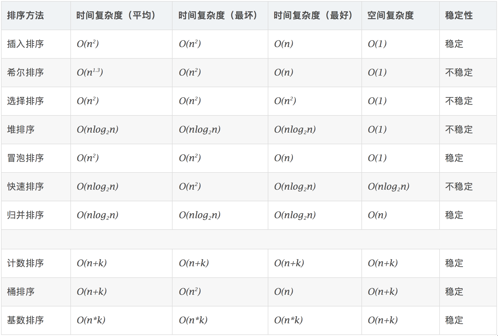

# 内排序

## 总览


## 性能对比



**算法稳定性**

假定在待排序的记录序列中，存在多个具有相同的关键字的记录，若经过排序，这些记录的相对次序保持不变，即在原序列中，A1=A2，且A1在A2之前，而在排序后的序列中，A1仍在A2之前，则称这种排序算法是稳定的；否则称为不稳定的。

排序算法是否为稳定的是由具体算法决定的，不稳定的算法在某种条件下可以变为稳定的算法，而稳定的算法在某种条件下也可以变为不稳定的算法。

**算法稳定性干啥的**

算法稳定性的意义一般体现在按不同标准多次排序的场景

比如一个班的学生已经按照学号大小排好序了，现在要求按照年龄从小到大再排个序，如果年龄相同的，必须按照学号从小到大的顺序排列。如果选择的年龄排序方法是不稳定的，排序完了后年龄相同的一组学生学号就乱了；如果是稳定的排序算法，就只需要按照年龄排一遍就好了。

## 插入排序

### 直接插入排序

```c++
void insertSort(vector<int>& v, int begin, int end) {
	/*直接插入排序：将有序数列外的元素插入有序数列，使有序数列一步步扩大，直至
	全体有序，即完成排序*/
	//初始时，默认第一个元素构成有序序列，因此第一个插入的元素是第二个元素
	for (int i = begin + 1; i <= end; i++) {
		int temp = v[i];//暂存待插入元素
		int j = i;//j就是插入的位置，默认插在有序序列尾（待查元素本来的位置）
		//开始找位置
		while (j > begin && v[j - 1] > temp) {
			v[j] = v[j - 1];//找位置的同时移位
			j--;
		}
		v[j] = temp;//找到v[j-1]<temp,插到它后面，即插入到v[j]
	}
}
```

### 希尔排序

一种优化的插入排序算法

```c++
void ShellSort(vector<int>& v, int begin, int end) {
	/*将距离为gap的整数倍的元素划分在一个子序列，对这些子序列进行直接插入排序
	使它们有序，然后缩小gap，重新划分，重复上述步骤，直至gap=1的划分全部排好序，
	集合全体就排号序了*/
	//其实就是比直接插入排序外层多了个用于更新gap的循环，在比较和挪位时衡量的长度变为gap
	for (int gap = (begin + end) / 2+1; gap > 0; gap = gap / 2) {
		//实际上就是比较和挪位时衡量的长度变为gap的直接插入排序
		for (int i = begin + gap; i <= end; i++) {
			int temp = v[i];
			int j = i;
			while (j >= begin+gap && v[j - gap] > temp) {//这里条件时>=
				v[j] = v[j - gap];
				j=j-gap;
			}
			v[j] = temp;
		}
	}
}
```

## 堆排序

注：以最小堆为例

**最初的思路**

最小堆的第一个元素是min，那就`deleteMin`得到min，将它放到另一个数组`temp`里，一直重复操作,temp里的元素就是有序的，最后将temp的元素`copy`回原数组

**优化一下——不额外开辟空间**

将堆第一个元素和堆最后一个元素交换，然后堆大小-1，调整堆序性，不断重复上述操作直至堆大小为0

这样操作可以避免额外开辟空间，用最小堆进行堆排序得到递减序列，用最大堆进行堆排序得到递增序列

**代码**

```c++
void siftDown(T* arr,int start, int PosLastNode) {
	int PosFather = start;
	int PosChild = 2 * start + 1;
	T fatherKey = arr[PosFather];
	while (PosChild <= PosLastNode) {
		if (PosChild<PosLastNode && arr[PosChild]>arr[PosChild + 1])
			PosChild++;
		if (arr[PosFather] <= arr[PosChild])break;
		if (arr[PosFather] > arr[PosChild]) {
			arr[PosFather] = arr[PosChild];
			arr[PosChild] = fatherKey;
			PosFather = 2 * PosFather + 1;
			PosChild = 2 * PosFather + 1;
			fatherKey = arr[PosFather];
		}
	}
}
template <class T>
void heapSort(T* arr, int length) {
	//先将传入的数组调整为堆
	for (int i = (length - 2) / 2; i >= 0; i--)
		siftDown(arr, i, length - 1);
	//将最小元素和堆最后一个元素交换位置，堆大小-1
	for (int i = length - 1; i >0; i--) {
		swap(arr[i], arr[0]);
		siftDown(arr, 0, i - 1);
	}
}
```

## 归并排序

**divide-and-conquer分治思想(以二路归并为例)**

要排序全集S，就将全集S的前一半元素划分为S1，后一半元素划分为S2，排序S1，S2（这个排序也是遵从上面的策略），最后将有序的S1和S2合并成有序的全集S

从上面描述可知，归并排序就是将要排序的集合一步步划分为小集合，当这些小集合有序后，一步步返回合并为规模更大的有序集合，最终合并为有序的全集

因此可以用递归的方式实现递归算法：一步步将问题划分为更小的子问题，在返回（归）的过程中合并

**怎么合并两个有序集合**

>The basic merging algorithm takes two input arrays A and B, an output array C, and three counters, Actr, Bctr, and Cctr, which are initially set to the beginning of their respective arrays. The smaller of A[Actr] and B[Bctr] is copied to the next entry in C, and the appropriate counters are advanced. When either input list is exhausted, the remainder of the other list is copied to C

写代码时，可以用一个暂存数组保存合并的结果，然后将暂存数组返回给原来的数组

**代码（二路归并）**

```c++
void merge(vector<int>& v, int* temp, int begin, int mid ,int end) {
	int tempPos = begin;//暂存数组的起始位置：S1的起始
	int leftStart = begin;//S1的起始位置
	int leftEnd = mid;//S1的终止位置
	int rightStart = mid + 1;//S2的起始位置
	int rightEnd = end;//S2的终止位置
	int N = end - begin + 1;//记录S1和S2一共有多少元素
	int i = leftStart;//指针i遍历S1
	int j = rightStart;//指针j遍历S2
	//i，j分别遍历有序集合S1和S2，将小的放到暂存数组
	while (i <= leftEnd && j <= rightEnd) {//终止：S1或S2的所有元素都放到暂存数组了
		if (v[i] < v[j])temp[tempPos++] = v[i++];
		else temp[tempPos++] = v[j++];
	}
	while (i <= leftEnd) temp[tempPos++] = v[i++];//将S1剩余的元素放入暂存数组
	while (j <= rightEnd) temp[tempPos++] = v[j++];//将S2剩余的元素放入暂存数组
	//经过上述操作，暂存数组的begin到end这部分就是有序的，将它放回数组v
	for (int k = begin; k < begin+N; k++)v[k] = temp[k];
}

void mergeSort(vector<int>& v,int* temp,int begin,int end) {
	if (begin >= end)return;//划分的集合里只有0或1个元素，不用排序直接返回
	else {
		int mid = (begin + end) / 2;//二路归并，将集合S划分为S1和S2
		mergeSort(v, temp, begin, mid);//排序前一半元素S1
		mergeSort(v, temp, mid + 1, end);//排序后一半元素S2
		merge(v, temp, begin, mid, end);//将这两部分元素合并为一个有序序列
	}
}
```

## 交换排序

### 冒泡排序

**经典冒泡**

```c++
void bubbleSort(vector<int>& v, int begin, int end) {
	/*冒泡排序：要排序的数据有n个，则需要排n-1轮,每轮轮比完会将序列分
      为无序区和有序区两个区间，每轮排序都将最大元素交换到了最后（有序区的首位置），
	  每轮排序从begin开始相邻数据两两比较，若反序则交换，直到无序区比较完无序区
	  的最后两个元素
*/
	bool exchange;
	for (int i = 0; i < end - begin; i++) {//排n-1轮
		exchange = false;
		for (int j = begin; j < end - i; j++) {//每轮排序的逻辑
			if (v[j] > v[j + 1]) {
				swap(v[j], v[j + 1]);
				exchange = true;
			}
		}
		if (exchange == false)break;
	}
}
```

**优化冒泡**

```c++

```

### 快速排序

**和归并排序一样，快排也采用 divide-and conquer 思想，可以用递归算法实现**

**对比归并排序的优势在于子问题的规模不要求一样大**

>Like mergesort, it recursively solves two subproblems and requires linear additional work (step 3), but, unlike mergesort, the subproblems are not guaranteed to be of equal size, which is potentially bad. The reason that quicksort is faster is that the partitioning step can actually be performed in place and very efficiently. This efficiency more than makes up for the lack of equal-sized recursive calls.

**典型的快排包括以下四步**

从集合里拿出一个参照物（pivot），然后将剩余元素分成两部分（partition）：所有元素<=pivot的区域S1和所有元素均>=pivot的区域S2,最终返回S1+pivot+S2
>1、If the number of elements in S is 0 or 1, then return.
2、Pick any element v in S. This is called the pivot.
3、Partition S − {v} (the remaining elements in S) into two disjoint groups: S1 = {x ∈S − {v}|x ≤ v}, and S2 = {x ∈ S − {v}|x ≥ v}.
4、 Return {quicksort(S1) followed by v followed by quicksort(S2)}

step2和step3实现的方法有很多种

**step2：如何选择参照物pivot**

* 不要选第一个元素作为pivot:
多数情况下，我们的输入是有序或部分有序的，这个时候挑选第一个元素作pivot，根据它分区会很不理想（因为两个分区元素数量差距会很悬殊，甚至有一个分区没有元素），这会导致浪费很多时间做无用的事
>if the input is presorted or in reverse order, then the pivot provides a poor partition, because either all the elements go into S1 or they go into S2.

* 最好的选择：从集合中找三个元素（一般是begin，mid，end），取它们的中位数作pivot

**step3：partiton**

**代码**
```c++
int partition(vector<int>& v,int begin,int end) {
	int midPos = (begin + end) / 2;
	/*将三者的中位数选为pivot，移到v[end], 排序时就排begin到end - 1这个区间的数,
	这是为了将pivot剔除出待排序的全集，等区间内的元素排好序后再将pivot接回来*/
	if (v[begin] > v[midPos])swap(v[begin], v[midPos]);
	if (v[end] > v[midPos])swap(v[midPos], v[end]);
	if (v[begin] > v[end])swap(v[begin], v[end]);
	return v[end];
}
void quickSort(vector<int>& v, int begin,int end) {
	if (begin >= end)return;//若待排序的集合只有0或1个元素，直接返回
	int pivot = partition(v,begin,end);//获得pivot，并将pivot剔除出待排序集合
	/*指针i从头出发，在元素>pivot的地方停下，指针j从尾出发，在元素<pivot的地方停下，
	交换两指针所指元素，然后重复上述操作直到i和j相遇或i超过j。*/
	int i = begin-1;
	int j = end;
	while(1) {
		while (v[++i] < pivot) {}
		while (v[--j] > pivot) {}
		if (i < j)swap(v[i], v[j]);
		else break;
	}
	/*i >= j, 这一轮排序结束，把pivot接回来，放在v[i]位置，这样保障了i左侧所有元素
	 小于pivot，i右侧所有元素大于pivot*/
	swap(v[i], v[end]);
	//经过上面操作，以pivot为参照，划分了S1和S2，现在分别对它们再继续进行快排
	quickSort(v, begin, i - 1);//对S1快排
	quickSort(v, i + 1, end);//对S2快排
}
```
**优化快排**

快排在数据量小（N<=20）的时候效率一般。我们可以在一开始数据量很大时用快排，当子序列的数据量缩小到一定值(5~15之间)，就转而用插入排序或其他在数据量小时效率更高的排序算法

>A common solution is not to use quicksort recursively for small arrays, but instead use a sorting algorithm that is efficient for small arrays, such as insertion sort. Using this strategy can actually save about 15 percent in the running time (over doing no cutoff at all). A good cutoff range is N = 10, although any cutoff between 5 and 20 is likely to produce similar results. This also saves nasty degenerate cases, such as taking the median of three elements when there are only one or two.

下面给出直接插入和快排混合算法

```c++
void quickInsertSort(vector<int>& v, int begin, int end) {
	//数据量小的时候转而用直接插入排序
	if (end - begin <= 10) insertSort(v, begin, end);
	else {//数据量大的时候用快排
		int pivot = partition(v, begin, end);
		int i = begin - 1;
		int j = end;
		while (1) {
			while (v[++i] < pivot) {}
			while (v[--j] > pivot) {}
			if (i < j)swap(v[i], v[j]);
			else break;
		}
		swap(v[i], v[end]);
		quickInsertSort(v, begin, i - 1);
		quickInsertSort(v, i + 1, end);
	}
}
```

## 直接选择排序

```c++
void selectSort(vector<int>& v, int begin, int end) {
	/*直接选择排序：在v[i]到v[end]中找到最小元素的位置（初始时i=begin），
	让它和第一个元素v[i]对调，然后i++，重复上述操作，当i=end-1时，全体排好序*/
	/*将数组看成左边的有序集合S1与右边的无序集合S2，将无序集合S2的最小元素v移动到
	S2首位置，那么v就自动加入到了S1，这时的S2就是原先的S2剔除掉首元素，重复上述
	操作，直到S1为全集，S2为空集，排序完成*/
	for (int i = begin; i < end; i++) {
		int minPos = i;//记录无序集合S2中最小元素的位置（默认为S2首元素）
		//开始找最小元素
		for (int j = i + 1; j <= end; j++) {
			if (v[j] < v[minPos])minPos = j;
		}
		//找到最小元素位置，如果最小元素不是S2的首元素，就移到首元素，否则不用动
		if (minPos != i)swap(v[i], v[minPos]);
	}
}
```

## Bucket Sort桶排序

## Counting Sort基数排序

## Radix Sort基数排序

## 链表实现排序算法

https://www.cnblogs.com/TenosDoIt/p/3666585.html

# 外排序